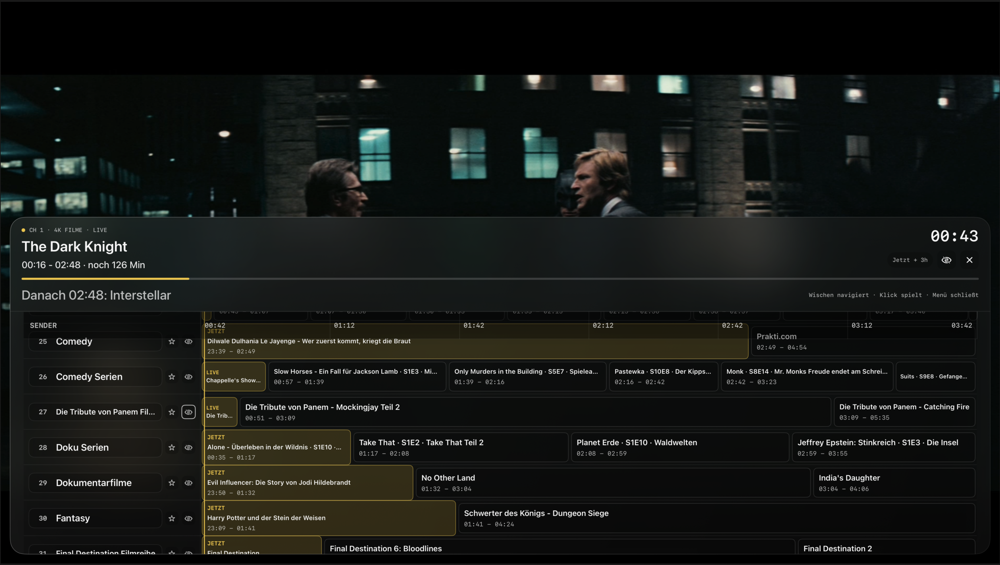

# analoq

analoq is a free and open source Apple TV app that turns your Plex collections into a live TV-style experience.

Instead of browsing posters and folders, analoq takes the collections you already curated and turns them into always-on "live" channels with a guide and a lean-back TV interface.

> [!IMPORTANT]
> Full Disclosure: This is a 100% 'vibe-coded' project.
> The goal is to have a free and open-source alternative for Apple TV.

## Highlights

- Apple TV-first experience designed for tvOS
- Continuous channel playback built from your Plex collections
- Guide-style viewing flow that feels closer to television than streaming menus
- Fast, focused UI for discovering something to watch without overthinking it
- Live playback overlay and translucent guide overlay for channel surfing
- Favorites and hidden channels directly in the guide
- Creates "live" channels from collections instead of exposing your library as a normal on-demand browser

## Install Options

There are two ways to install the app on Apple TV:

- Build and run directly from Xcode on Apple TV
- Sideload the app to your own Apple TV using tools like ATVLoadly

## Platform

- tvOS 17+
- SwiftUI
- Apple TV

## How To Use

1. Launch the app on Apple TV.
2. Scan the QR code to sign in with your Plex account.
3. Pick the server you want to use for playback.
4. Choose which libraries should be used as the source for collections.
5. analoq reads the collections inside those libraries and turns them into "live" channels.
6. Wait for the channel lineup to load and playback to start.
7. While watching live TV:
   - Use `Up` and `Down` to zap between channels.
   - Press `Play/Pause` to show the playback overlay.
   - Press `Back` to open the guide overlay.
8. Inside the guide overlay:
   - Select a channel row to tune immediately.
   - Select a program block to inspect what is on now or next.
   - Use the `star` action to favorite a channel.
   - Use the `eye` action to hide or unhide a channel.
9. Press `Back` to open or close the guide.

## Screenshots

### Playback Overlay

### Guide Overlay

